# RAG Enterprise LangGraph App

Minimal LangGraph application that uses the existing
`rag-enterprise-mcp` wrapper as its only enterprise RAG tool layer.

## Architecture

- This repo does not implement retrieval, ACL checks, citations, or backend
  governance logic.
- The LangGraph agent talks to the MCP wrapper over stdio through
  `MultiServerMCPClient`.
- The MCP wrapper remains responsible for exposing:
  - `ask_grounded`
  - `search_documents`
  - `get_document_excerpt`
- The MCP wrapper continues to call the real backend in
  `RAG_ENTERPRISE_STARTER`.

## Repo layout

- `src/rag_enterprise_langgraph/config.py` runtime settings
- `src/rag_enterprise_langgraph/mcp_client.py` MCP stdio connection setup
- `src/rag_enterprise_langgraph/graph.py` LangGraph wiring
- `src/rag_enterprise_langgraph/agent.py` thin orchestration layer
- `src/rag_enterprise_langgraph/orchestrator.py` strict MCP recovery and answer-quality engine
- `src/rag_enterprise_langgraph/answer_quality.py` question classification, answer-shape checks, and citation support review
- `src/rag_enterprise_langgraph/evidence.py` evidence validation and editable rules
- `src/rag_enterprise_langgraph/eval_runner.py` Excel QA eval harness
- `src/rag_enterprise_langgraph/journal.py` safe JSONL decision journal
- `src/rag_enterprise_langgraph/approval.py` human approval gate and persisted approval store
- `src/rag_enterprise_langgraph/audit.py` tamper-evident hash-chained audit log
- `src/rag_enterprise_langgraph/eval_store.py` persisted eval run summaries and metrics
- `src/rag_enterprise_langgraph/red_team.py` red-team scenario runner and report
- `src/rag_enterprise_langgraph/ui.py` browser dashboard (approvals, audit, evals, red team, demo)
- `src/rag_enterprise_langgraph/cli.py` local smoke-test entrypoint
- `src/rag_enterprise_langgraph/server.py` FastAPI API + dashboard
- `config/orchestration-rules.json` user-editable rule extensions
- `config/red-team-findings.json` red-team scenario definitions
- `tests/` config, graph, orchestration, proof, eval, journal, approval, audit, UI, and red-team tests

## Python version

Use Python 3.10+.

The current `langchain-mcp-adapters` package does not support Python 3.9.
This workspace was scaffolded and tested with:

- `/Users/Work/.local/bin/python3.12`

## Environment

Copy `.env.example` to `.env` and adjust as needed.

Important settings:

- `RAG_AGENT_MODEL_PROVIDER`
- `RAG_AGENT_MODEL_NAME`
- `RAG_AGENT_MCP_SERVER_PYTHON`
- `RAG_AGENT_MCP_SERVER_REPO`
- `RAG_AGENT_MCP_SERVER_MODULE`
- `RAG_BACKEND_BASE_URL`
- `RAG_BACKEND_BEARER_TOKEN`
- `RAG_BACKEND_DEV_LOGIN_EMAIL`
- `RAG_BACKEND_DEV_LOGIN_PASSWORD`

## Install

```bash
/Users/Work/.local/bin/python3.12 -m venv .venv312
.venv312/bin/pip install -e .[dev]
```

## Smoke test

Diagnostics:

```bash
PYTHONPATH=src .venv312/bin/python -m rag_enterprise_langgraph.cli --check-config
```

CLI:

```bash
PYTHONPATH=src .venv312/bin/python -m rag_enterprise_langgraph.cli "What does the employee handbook say about VPN access?"
```

API:

```bash
PYTHONPATH=src .venv312/bin/python -m rag_enterprise_langgraph.server
```

Then:

```bash
curl -X POST http://127.0.0.1:8080/ask \
  -H "Content-Type: application/json" \
  -d '{"question":"What does the employee handbook say about VPN access?"}'
```

## Portfolio demo proof

Run a screenshot-friendly proof flow. This path uses the shared orchestrator:
`ask_grounded` first, then bounded recovery with `search_documents` and
`get_document_excerpt` when the first pass is weak, not found, incomplete,
uncited, or unsupported by its citations. Citation presence alone is not
treated as proof.

```bash
PYTHONPATH=src .venv312/bin/python -m rag_enterprise_langgraph.cli --demo-proof
```

Use questions matched to your indexed backend sources:

```bash
PYTHONPATH=src .venv312/bin/python -m rag_enterprise_langgraph.cli --demo-proof \
  --question "What does the employee handbook say about VPN access?"
```

Or keep editable questions in a plain text file:

```bash
PYTHONPATH=src .venv312/bin/python -m rag_enterprise_langgraph.cli --demo-proof \
  --questions-file demo-questions.txt \
  --output demo-proof.md
```

Useful proof flags:

```bash
PYTHONPATH=src .venv312/bin/python -m rag_enterprise_langgraph.cli --demo-proof \
  --question "What Percentage of Rent to Sales did Sam Walton's first Ben Franklin cost?" \
  --max-recovery-steps 3 \
  --max-attempts 3 \
  --validation-mode balanced \
  --show-decision-trail
```

Use editable evidence rules and a safe run journal:

```bash
PYTHONPATH=src .venv312/bin/python -m rag_enterprise_langgraph.cli --demo-proof \
  --question "What seminar did Sam Walton enroll himself in in Poughkeepsie New York?" \
  --rules config/orchestration-rules.json \
  --journal runs/orchestration-journal.jsonl
```

Use `--include-debug` only for internal troubleshooting. Normal proof output
hides raw debug payloads, tracebacks, local paths, and secrets.

## Evaluation harness

Run the Acquired QA workbook against the same orchestrator:

```bash
PYTHONPATH=src .venv312/bin/python -m rag_enterprise_langgraph.cli \
  --eval-xlsx /Users/Work/Desktop/acquired-qa-evaluation.xlsx \
  --eval-output acquired-eval-report.md \
  --eval-json acquired-eval-results.json \
  --journal runs/orchestration-journal.jsonl \
  --rules config/orchestration-rules.json
```

The eval runner treats the workbook `human_answer` column as ground truth,
compares generated answers and validated evidence against expected terms, and
marks each row as `pass`, `fail`, or `manual_review`.

The API also exposes the same orchestrated proof shape:

```bash
curl http://127.0.0.1:8080/demo-proof
```

And a single-question orchestrated answer endpoint:

```bash
curl -X POST http://127.0.0.1:8080/ask-orchestrated \
  -H "Content-Type: application/json" \
  -d '{"question":"What seminar did Sam Walton enroll himself in in Poughkeepsie New York?"}'
```

See `docs/portfolio-demo-proof.md` for screenshot guidance and Upwork-ready
caption ideas.

## Governance: human approval gate, audit log, and dashboard

This app can be truthfully described as a LangGraph/MCP reasoning workflow
with human approval and a full audit log — automation you can inspect.

### Start the API + browser dashboard

```bash
PYTHONPATH=src .venv312/bin/python -m rag_enterprise_langgraph.server
```

Then open <http://127.0.0.1:8080/app>. Pages:

- `/app` ask panel with "Require approval" toggle, workflow timeline, decision trail
- `/app/approvals` approval queue with approve/reject, reviewer name, and comment
- `/app/audit` run list and hash-chained event timeline per `run_id`
- `/app/evals` accuracy, faithfulness/grounding, latency, estimated cost/query
- `/app/red-team` red-team findings table
- `/app/demo` before/after automation comparison for screen recordings

### Human approval gate

High-risk answers (HR, legal, finance, medical, security, compliance/policy,
plus any `needs_review`/`partial`/`review_recommended` result) can be held at
`pending_approval`. The answer is withheld until a named reviewer approves or
rejects it; decisions are persisted in `runs/approvals.jsonl` and written to
the audit log.

```bash
# Run a high-risk question through the gated workflow
PYTHONPATH=src .venv312/bin/python -m rag_enterprise_langgraph.cli \
  "What is the employee termination policy?" --require-approval

# Review the queue, then approve or reject
PYTHONPATH=src .venv312/bin/python -m rag_enterprise_langgraph.cli --list-approvals
PYTHONPATH=src .venv312/bin/python -m rag_enterprise_langgraph.cli \
  --approve APPROVAL_ID --reviewer "Alice" --comment "Verified against source"
PYTHONPATH=src .venv312/bin/python -m rag_enterprise_langgraph.cli \
  --reject APPROVAL_ID --reviewer "Alice" --comment "Wrong source cited"
```

Approval modes: `--approval-risk-mode off|high-risk-only|always`.
API: `POST /approval/request`, `GET /approval/pending`, `GET /approval/{id}`,
`POST /approval/{id}/approve`, `POST /approval/{id}/reject`.

### Full audit log

Every orchestrated run has a stable `run_id` and emits sanitized,
hash-chained events (`run_started`, `question_classified`, `tool_call_*`,
`answer_reviewed`, `evidence_validated`, `recovery_*`, `approval_*`,
`run_completed`) to `runs/audit-log.jsonl`. The chain survives restarts and
tampering is detectable.

```bash
PYTHONPATH=src .venv312/bin/python -m rag_enterprise_langgraph.cli --show-audit RUN_ID
PYTHONPATH=src .venv312/bin/python -m rag_enterprise_langgraph.cli --export-audit RUN_ID
```

API: `GET /audit/runs`, `GET /audit/runs/{run_id}`, `GET /audit/events`,
`GET /audit/export/{run_id}`.

### Eval dashboard

Persist eval runs and view accuracy, faithfulness/grounding rate, average
latency, and estimated cost/query (a labeled estimate from configurable token
costs — never presented as exact billing):

```bash
PYTHONPATH=src .venv312/bin/python -m rag_enterprise_langgraph.cli \
  --eval-xlsx /Users/Work/Desktop/acquired-qa-evaluation.xlsx --save-eval-run
PYTHONPATH=src .venv312/bin/python -m rag_enterprise_langgraph.cli --eval-runs
PYTHONPATH=src .venv312/bin/python -m rag_enterprise_langgraph.cli --show-eval-run EVAL_RUN_ID
```

Cost settings: `RAG_AGENT_INPUT_TOKEN_COST_PER_1M`,
`RAG_AGENT_OUTPUT_TOKEN_COST_PER_1M`,
`RAG_AGENT_DEFAULT_ESTIMATED_TOKENS_PER_QUERY`.
API: `POST /eval/run`, `GET /eval/runs`, `GET /eval/runs/{id}`, `GET /eval/latest`.

### Red-team findings

Deterministic checks run the real validation code paths offline (prompt
injection in retrieved text, missing/irrelevant citations, numeric mismatch,
unsupported list items, timeout/auth failures, high-risk approval, rule
override attempts). Backend-dependent scenarios are honestly labeled
`requires_backend` — no fabricated security passes.

```bash
PYTHONPATH=src .venv312/bin/python -m rag_enterprise_langgraph.cli --red-team \
  --red-team-output red-team-report.md \
  --red-team-json red-team-results.json
```

API: `GET /red-team/findings`, `POST /red-team/run`, `GET /red-team/latest`.

### Before/after automation demo

`/app/demo` (or `POST /demo/before-after`) runs the actual raw first-pass
`ask_grounded` answer next to the governed orchestrated result. If the backend
is unavailable it shows a clean error state — the "before" column is never an
invented bad answer.

## Notes

- The agent prompt tells the model to prefer `ask_grounded` first for direct
  question answering, then use retrieval-only recovery when first-pass
  synthesis is weak, not found, uncited, or affected by chunk boundaries.
- The orchestrator validates both first-pass cited answers and recovered
  evidence. A cited answer becomes `verified` only when its answer shape and
  cited snippets support the requested fields or list items.
- Source-level matches or irrelevant snippets are returned as `needs_review`
  or `not_grounded` rather than a misleading success.
- Demo/API proof output includes a safe decision trail by default. It shows
  classification, validation, recovery, and final status without raw
  `debug_info`, prompts, tracebacks, tokens, local paths, or secrets.
- Commercial-facing outputs include a review note. `verified` and `recovered`
  are suitable for informational use, while high-impact business, legal,
  financial, medical, HR, security, or compliance decisions still require
  human review.
- `search_documents` and `get_document_excerpt` are also exposed for follow-up
  exploration and narrow excerpt lookup.
- Demo proof output shows a safe execution timeline instead of raw MCP
  tracebacks by default.
- `config/orchestration-rules.json` can be edited to add aliases, expected
  terms, and rule groups without changing Python code.
- The MCP tool layer normalizes weak-model tool arguments before dispatch, for
  example changing `search_documents.k=0` to the default `8` and filling a
  missing `question` from the original user prompt.
- Use `RAG_AGENT_DEBUG=false` for normal proof runs. Turn it on only when you
  want verbose LangGraph/MCP traces for screenshots.

## Proof screenshots

Exact portfolio screenshot names and where to capture each:

1. `Automated Test Suite: 45 Passing Governance & RAG Orchestration Tests` —
   `.venv312/bin/python -m pytest` (now 88 tests including governance).
2. `MCP Tool Discovery: Grounded RAG Tools Exposed via Stdio` —
   `--check-config` output listing `ask_grounded`, `search_documents`, `get_document_excerpt`.
3. `LangGraph Recovery Flow: Evidence-Gated Answer Validation` —
   `--demo-proof` execution timeline showing recovery steps.
4. `Enterprise Security Boundary: No Direct DB Access from Agent Layer` —
   the architecture diagram below rendered as PNG/SVG.
5. `Orchestrator Implementation: Bounded Recovery and Evidence Validation` —
   `orchestrator.py` open in an editor.
6. `Human Approval Gate: High-Risk RAG Automation Awaiting Review` —
   `/app/approvals` with a pending item, or CLI `--require-approval` output.
7. `Full Audit Log: Inspectable LangGraph/MCP Run Timeline` —
   `/app/audit` event timeline, or `--export-audit RUN_ID`.
8. `Eval Dashboard: Accuracy, Faithfulness, Latency, and Estimated Cost` —
   `/app/evals` after `--eval-xlsx ... --save-eval-run`.
9. `Red-Team Findings: Failure Modes Tested Before Deployment` —
   `/app/red-team` after running the checks, or `red-team-report.md`.
10. `Before/After Automation: From Weak RAG Answer to Governed Workflow` —
    `/app/demo` comparison view (also the 90-second screen recording page).

## LangGraph vs Custom Logic

LangGraph provides the reusable orchestration frame: stateful execution,
conditional routing, bounded recovery loops, tool invocation, future
checkpointing, and human-in-the-loop extension points. In this app it keeps
the MCP/RAG backend behind a controlled workflow instead of letting every
client invent its own retry behavior.

The custom code implements the answer-quality policy: question-type
classification, expected answer-shape checks, evidence support validation,
attempt comparison, safe decision trails, Markdown/JSON proof rendering, and
eval reporting. This split is intentional. The same graph pattern can sit in
front of SQL, Jira, CRM, ticketing, policy, or document-search tools, while
the validator can be adapted to each backend's evidence format.

## Architecture proof diagram

```mermaid
flowchart LR
    U["User / API Client"] --> Q["Classify Question Type<br/>custom answer-quality code"]
    Q --> LG["LangGraph Workflow<br/>state, routing, retries"]
    LG --> A["ask_grounded<br/>first-pass backend answer"]
    A --> V["Validate Answer Shape<br/>+ Citation Support"]
    V -->|complete| F["Verified Answer<br/>decision trail + review note"]
    V -->|weak| P["Recovery Planner<br/>targeted MCP calls"]
    P -->|stdio MCP| MCP["RAG Enterprise MCP Server<br/>search_documents<br/>get_document_excerpt"]
    MCP -->|HTTP + auth cookie/token| BE["Enterprise RAG Backend<br/>FastAPI"]
    BE --> AUTH["Auth + ACL Layer<br/>dev/OIDC auth<br/>SQL-level access trimming"]
    BE --> RET["Retrieval Layer<br/>hybrid/vector/keyword/graph modes"]
    BE --> LLM["Backend Answer Model<br/>grounded JSON answer<br/>citations"]
    RET --> DB["Postgres + pgvector<br/>documents, chunks, ACLs"]
    LLM --> BE
    AUTH --> RET
    BE -->|evidence + citations| MCP
    MCP --> P
    P --> V
    V -->|insufficient| H["Needs Review / Refusal"]
    MCP -->|structured tool output| LG
    LG -->|final answer + visible tool output| U

    subgraph Security Boundaries
      S1["LangGraph does not access DB"]
      S2["MCP has read-only RAG tools"]
      S3["Backend enforces auth + ACL"]
      S4["Retrieved text treated as untrusted evidence"]
      S5["Tool args validated and normalized"]
    end
```


