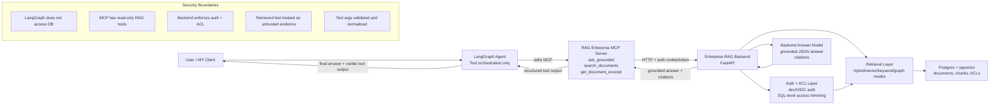

# RAG Enterprise LangGraph App

Minimal LangGraph application that uses the existing
`rag-enterprise-mcp` wrapper as its only enterprise RAG tool layer.

## Architecture

- This repo does not implement retrieval, ACL checks, citations, or backend
  governance logic.
- The LangGraph agent talks to the MCP wrapper over stdio through
  `MultiServerMCPClient`.
- The MCP wrapper remains responsible for exposing:
  - `ask_grounded`
  - `search_documents`
  - `get_document_excerpt`
- The MCP wrapper continues to call the real backend in
  `RAG_ENTERPRISE_STARTER`.

## Repo layout

- `src/rag_enterprise_langgraph/config.py` runtime settings
- `src/rag_enterprise_langgraph/mcp_client.py` MCP stdio connection setup
- `src/rag_enterprise_langgraph/graph.py` LangGraph wiring
- `src/rag_enterprise_langgraph/agent.py` thin orchestration layer
- `src/rag_enterprise_langgraph/cli.py` local smoke-test entrypoint
- `src/rag_enterprise_langgraph/server.py` tiny FastAPI wrapper
- `tests/` config and graph wiring tests

## Python version

Use Python 3.10+.

The current `langchain-mcp-adapters` package does not support Python 3.9.
This workspace was scaffolded and tested with:

- `/Users/Work/.local/bin/python3.12`

## Environment

Copy `.env.example` to `.env` and adjust as needed.

Important settings:

- `RAG_AGENT_MODEL_PROVIDER`
- `RAG_AGENT_MODEL_NAME`
- `RAG_AGENT_MCP_SERVER_PYTHON`
- `RAG_AGENT_MCP_SERVER_REPO`
- `RAG_AGENT_MCP_SERVER_MODULE`
- `RAG_BACKEND_BASE_URL`
- `RAG_BACKEND_BEARER_TOKEN`
- `RAG_BACKEND_DEV_LOGIN_EMAIL`
- `RAG_BACKEND_DEV_LOGIN_PASSWORD`

## Install

```bash
/Users/Work/.local/bin/python3.12 -m venv .venv312
.venv312/bin/pip install -e .[dev]
```

## Smoke test

Diagnostics:

```bash
PYTHONPATH=src .venv312/bin/python -m rag_enterprise_langgraph.cli --check-config
```

CLI:

```bash
PYTHONPATH=src .venv312/bin/python -m rag_enterprise_langgraph.cli "What does the employee handbook say about VPN access?"
```

API:

```bash
PYTHONPATH=src .venv312/bin/python -m rag_enterprise_langgraph.server
```

Then:

```bash
curl -X POST http://127.0.0.1:8080/ask \
  -H "Content-Type: application/json" \
  -d '{"question":"What does the employee handbook say about VPN access?"}'
```

## Portfolio demo proof

Run a screenshot-friendly proof flow. This path uses the shared orchestrator:
`ask_grounded` first, then bounded recovery with `search_documents` and
`get_document_excerpt` when the first pass is weak, not found, or uncited.

```bash
PYTHONPATH=src .venv312/bin/python -m rag_enterprise_langgraph.cli --demo-proof
```

Use questions matched to your indexed backend sources:

```bash
PYTHONPATH=src .venv312/bin/python -m rag_enterprise_langgraph.cli --demo-proof \
  --question "What does the employee handbook say about VPN access?"
```

Or keep editable questions in a plain text file:

```bash
PYTHONPATH=src .venv312/bin/python -m rag_enterprise_langgraph.cli --demo-proof \
  --questions-file demo-questions.txt \
  --output demo-proof.md
```

Useful proof flags:

```bash
PYTHONPATH=src .venv312/bin/python -m rag_enterprise_langgraph.cli --demo-proof \
  --question "What Percentage of Rent to Sales did Sam Walton's first Ben Franklin cost?" \
  --max-recovery-steps 3
```

Use `--include-debug` only for internal troubleshooting. Normal proof output
hides raw debug payloads, tracebacks, local paths, and secrets.

The API also exposes the same orchestrated proof shape:

```bash
curl http://127.0.0.1:8080/demo-proof
```

And a single-question orchestrated answer endpoint:

```bash
curl -X POST http://127.0.0.1:8080/ask-orchestrated \
  -H "Content-Type: application/json" \
  -d '{"question":"What seminar did Sam Walton enroll himself in in Poughkeepsie New York?"}'
```

See `docs/portfolio-demo-proof.md` for screenshot guidance and Upwork-ready
caption ideas.

## Notes

- The agent prompt tells the model to prefer `ask_grounded` first for direct
  question answering, then use retrieval-only recovery when first-pass
  synthesis is weak, not found, uncited, or affected by chunk boundaries.
- `search_documents` and `get_document_excerpt` are also exposed for follow-up
  exploration and narrow excerpt lookup.
- Demo proof output shows a safe execution timeline instead of raw MCP
  tracebacks by default.
- The MCP tool layer normalizes weak-model tool arguments before dispatch, for
  example changing `search_documents.k=0` to the default `8` and filling a
  missing `question` from the original user prompt.
- Use `RAG_AGENT_DEBUG=false` for normal proof runs. Turn it on only when you
  want verbose LangGraph/MCP traces for screenshots.

## Proof screenshots

- Test proof: `.venv312/bin/pytest` showing all tests passed.
- MCP discovery proof: CLI output showing `tools/list` with `ask_grounded`,
  `search_documents`, and `get_document_excerpt`.
- CLI proof: final answer plus execution timeline showing
  `ask_grounded -> search_documents -> get_document_excerpt` when recovery is
  needed.
- Backend proof: backend terminal showing `POST /ask HTTP/1.1 200 OK`.
- API proof: `curl http://127.0.0.1:8080/demo-proof` or
  `/ask-orchestrated` returning strict grounding status.
- Code proof: `mcp_client.py` showing `MultiServerMCPClient` stdio setup and
  `graph.py` showing the LangGraph agent prompt.

## Architecture proof diagram


