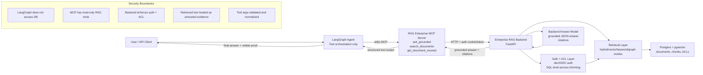

# Portfolio Demo Proof Pack

This guide packages the LangGraph + MCP integration into screenshots and proof
artifacts suitable for an Upwork portfolio. It covers only this LangGraph app.
The RAG backend remains the owner of retrieval, ACL trimming, citations, audit,
cache, and governance.

## What The Demo Proves

- LangGraph orchestrates enterprise RAG questions without direct database access.
- MCP tool discovery exposes `ask_grounded`, `search_documents`, and `get_document_excerpt`.
- The agent calls the MCP server over stdio.
- The MCP server calls the existing enterprise RAG backend over HTTP.
- Backend responses return grounded answers, citations, mode, latency, and chunk counts when available.
- Tool arguments and diagnostics are normalized and redacted for safe proof sharing.
- The proof runner refuses unsupported answers and marks auth, timeout, tool, and uncited-answer failures explicitly.
- The execution timeline shows multi-step recovery when first-pass synthesis misses evidence.

## Methodology

The orchestrator follows the same practical pattern that works well in Claude
Desktop:

1. `ask_grounded` is the first pass. It asks the backend to retrieve, rerank,
   synthesize, and cite.
2. If first-pass synthesis returns no citations, says "not found", or fails,
   the proof runner does not call that a success.
3. `search_documents` is used for retrieval-only recovery when evidence may
   exist but the backend generation step missed it.
4. `mode="keyword"` is preferred for exact names, dates, percentages, quoted
   phrases, identifiers, and transcript wording.
5. `exact_phrase_bias` and `anchor_terms` pin distinctive terms from the user
   question.
6. `expand_neighbors=true` helps when useful text is split across chunk
   boundaries.
7. `get_document_excerpt` fetches raw evidence from a concrete source/result
   and bypasses weak local answer synthesis.
8. If the system still cannot find evidence, it returns a clear no-grounded-
   answer result instead of a confident unsupported answer.

## Commands

Check config and MCP tool discovery:

```bash
rag-enterprise-agent --check-config
```

Run the default demo proof questions:

```bash
rag-enterprise-agent --demo-proof
```

Run one editable question:

```bash
rag-enterprise-agent --demo-proof --question "What does the employee handbook say about VPN access?"
```

Run questions from a file:

```bash
rag-enterprise-agent --demo-proof --questions-file demo-questions.txt
```

Create the Markdown report:

```bash
rag-enterprise-agent --demo-proof --output demo-proof.md
```

Return proof JSON:

```bash
rag-enterprise-agent --demo-proof --json
```

Run a recovery-oriented proof question:

```bash
rag-enterprise-agent --demo-proof \
  --question "What Percentage of Rent to Sales did Sam Walton's first Ben Franklin cost?" \
  --max-recovery-steps 3
```

Include sanitized internals only while debugging:

```bash
rag-enterprise-agent --demo-proof --include-debug --json
```

Start the API and capture the proof endpoint:

```bash
rag-enterprise-api
curl http://127.0.0.1:8080/demo-proof
```

Capture a single orchestrated answer:

```bash
curl -X POST http://127.0.0.1:8080/ask-orchestrated \
  -H "Content-Type: application/json" \
  -d '{"question":"What seminar did Sam Walton enroll himself in in Poughkeepsie New York?"}'
```

Use repeated `question` query parameters for custom API questions:

```bash
curl "http://127.0.0.1:8080/demo-proof?question=What%20does%20the%20policy%20say%3F"
```

## Editable Questions File

Create a plain text file such as `demo-questions.txt`:

```text
What does the employee handbook say about VPN access?
Summarize the policy with citations.
Find the most relevant source excerpt for VPN access.
```

Blank lines and lines starting with `#` are ignored. Update the questions after
you know which documents are indexed in the backend.

## Screenshot Checklist

1. Terminal showing `rag-enterprise-agent --check-config` with MCP tool names.
2. Terminal showing `rag-enterprise-agent --demo-proof` with grounding status, tools, evidence count, and execution timeline.
3. `demo-proof.md` showing runtime summary, MCP inventory, execution timeline, and a recovered answer.
4. Code screenshot of `src/rag_enterprise_langgraph/mcp_client.py` showing stdio MCP setup.
5. Code screenshot of `src/rag_enterprise_langgraph/graph.py` showing the LangGraph prompt rules.
6. API proof screenshot of `curl http://127.0.0.1:8080/demo-proof`.
7. Optional proof of strict refusal: a run marked `backend_auth_failed`, `backend_timeout`, or `not_grounded` instead of a misleading success.

## Upwork Caption Ideas

- "Built a LangGraph agent that accesses enterprise knowledge only through MCP tools, keeping retrieval and ACL enforcement inside the governed backend."
- "Implemented a screenshot-ready proof pack showing MCP discovery, multi-step tool recovery, grounded answers, citations/evidence, and backend-governance boundaries."
- "Designed the integration so the agent has no direct database access; MCP exposes only read-only RAG tools."
- "Built a LangGraph enterprise RAG orchestrator that validates grounding, refuses unsupported answers, and recovers through keyword search and raw excerpt lookup when first-pass generation fails."

## Architecture



## Honest Boundary

The demo proof feature is not a second RAG implementation. It is a proof layer
for the existing integration. Document ingestion, retrieval, ACL/security
trimming, citations, audit trails, semantic cache policy, approval workflows,
and governance remain implemented in the enterprise RAG backend.

Clients that call this LangGraph CLI/API get the orchestration and strict proof
logic. Clients that call `rag-enterprise-mcp` directly still depend on their own
host model to make recovery decisions.
