# Portfolio Demo Proof Pack

This guide packages the LangGraph + MCP integration into screenshots and proof
artifacts suitable for an Upwork portfolio. It covers only this LangGraph app.
The RAG backend remains the owner of retrieval, ACL trimming, citations, audit,
cache, and governance.

## What The Demo Proves

- LangGraph orchestrates enterprise RAG questions without direct database access.
- MCP tool discovery exposes `ask_grounded`, `search_documents`, and `get_document_excerpt`.
- The agent calls the MCP server over stdio.
- The MCP server calls the existing enterprise RAG backend over HTTP.
- Backend responses return grounded answers, citations, mode, latency, and chunk counts when available.
- Tool arguments and diagnostics are normalized and redacted for safe proof sharing.
- The proof runner refuses unsupported answers and marks auth, timeout, tool, and uncited-answer failures explicitly.
- First-pass cited answers are validated before acceptance. Citations are treated
  as evidence to inspect, not automatic proof.
- The answer-quality loop classifies question type, checks expected answer
  shape, validates support per value/list item, compares attempts, and exposes
  a safe decision trail.
- The execution timeline shows multi-step recovery when first-pass synthesis misses evidence.
- Evidence-gated recovery prevents false-positive demos where an irrelevant
  snippet is found in the right document but does not answer the question.
- The eval harness reruns the Acquired QA workbook and compares answers against
  the human-answer column for repeatable manual tuning.

## Methodology

The orchestrator follows the same practical pattern that works well in Claude
Desktop:

1. `ask_grounded` is the first pass. It asks the backend to retrieve, rerank,
   synthesize, and cite.
2. The answer-quality layer classifies the question, for example exact
   numeric, percentage/ratio, date, person/org, location, list-with-count,
   comparison, quote/exact wording, policy/compliance, or open-ended analysis.
3. If first-pass synthesis returns citations, the cited snippets are still
   checked against the expected answer shape. A three-item question needs three
   supported items. A percentage question needs the percentage supported by
   evidence.
4. If first-pass synthesis returns no citations, says "not found", is generic,
   misses a requested field, or cites unrelated text, the proof runner does
   not call that a success.
5. `search_documents` is used for retrieval-only recovery when evidence may
   exist but the backend generation step missed it.
6. `mode="keyword"` is preferred for exact names, dates, percentages, quoted
   phrases, identifiers, and transcript wording.
7. `exact_phrase_bias` and `anchor_terms` pin distinctive terms from the user
   question.
8. Precision recovery starts with low-k keyword search and only broadens when
   no validated candidate is found.
9. Evidence candidates are scored for anchor coverage, expected answer type,
   editable rule matches, snippet completeness, and backend scores.
10. `expand_neighbors=true` helps when useful text is split across chunk
   boundaries, but it is not the first recovery move.
11. `get_document_excerpt` fetches raw evidence from a concrete source/result
   and bypasses weak local answer synthesis.
12. Attempts are compared before finalizing. A verified first attempt is kept;
   a weaker later attempt does not replace it.
13. If retrieved text is present but does not answer the question, the run is
   marked `needs_review` or `not_grounded`, not `recovered`.
14. If the system still cannot find evidence, it returns a clear no-grounded-
   answer result instead of a confident unsupported answer.

## Commands

Check config and MCP tool discovery:

```bash
rag-enterprise-agent --check-config
```

Run the default demo proof questions:

```bash
rag-enterprise-agent --demo-proof
```

Run one editable question:

```bash
rag-enterprise-agent --demo-proof --question "What does the employee handbook say about VPN access?"
```

Run questions from a file:

```bash
rag-enterprise-agent --demo-proof --questions-file demo-questions.txt
```

Create the Markdown report:

```bash
rag-enterprise-agent --demo-proof --output demo-proof.md
```

Return proof JSON:

```bash
rag-enterprise-agent --demo-proof --json
```

Run a recovery-oriented proof question:

```bash
rag-enterprise-agent --demo-proof \
  --question "What Percentage of Rent to Sales did Sam Walton's first Ben Franklin cost?" \
  --max-recovery-steps 3 \
  --max-attempts 3 \
  --validation-mode balanced \
  --show-decision-trail
```

Run a first-pass validation proof:

```bash
rag-enterprise-agent --demo-proof \
  --question "When did AWS formed and who first head of AWS techincally?" \
  --show-decision-trail
```

Run a high-value recovery proof:

```bash
rag-enterprise-agent --demo-proof \
  --question "What is the cost of rocket travel based on the materials?" \
  --show-decision-trail
```

Use editable evidence rules and a safe decision journal:

```bash
rag-enterprise-agent --demo-proof \
  --question "What seminar did Sam Walton enroll himself in in Poughkeepsie New York?" \
  --rules config/orchestration-rules.json \
  --journal runs/orchestration-journal.jsonl
```

Run the Acquired workbook eval:

```bash
rag-enterprise-agent \
  --eval-xlsx /Users/Work/Desktop/acquired-qa-evaluation.xlsx \
  --eval-output acquired-eval-report.md \
  --eval-json acquired-eval-results.json \
  --journal runs/orchestration-journal.jsonl \
  --rules config/orchestration-rules.json
```

Include sanitized internals only while debugging:

```bash
rag-enterprise-agent --demo-proof --include-debug --json
```

Start the API and capture the proof endpoint:

```bash
rag-enterprise-api
curl http://127.0.0.1:8080/demo-proof
```

Capture a single orchestrated answer:

```bash
curl -X POST http://127.0.0.1:8080/ask-orchestrated \
  -H "Content-Type: application/json" \
  -d '{"question":"What seminar did Sam Walton enroll himself in in Poughkeepsie New York?"}'
```

Use repeated `question` query parameters for custom API questions:

```bash
curl "http://127.0.0.1:8080/demo-proof?question=What%20does%20the%20policy%20say%3F"
```

## Editable Questions File

Create a plain text file such as `demo-questions.txt`:

```text
What does the employee handbook say about VPN access?
Summarize the policy with citations.
Find the most relevant source excerpt for VPN access.
```

Blank lines and lines starting with `#` are ignored. Update the questions after
you know which documents are indexed in the backend.

## Editable Evidence Rules

The orchestrator ships with default rules for the current Acquired evaluation
questions. Add project-specific aliases or required terms in
`config/orchestration-rules.json` when manual review shows a repeated pattern.

Example use cases:

- Treat `5%`, `0.05`, and `five percent` as equivalent.
- Require `IBM` plus `seminar` for the Sam Walton Poughkeepsie question.
- Add accepted aliases for company names, people, products, places, and
  transcript-specific phrasing.

Rules are never self-promoted from a run journal. The journal can suggest what
went wrong, but the user must intentionally edit the rules file.

## Evaluation Report

The eval command reads the workbook `question` and `human_answer` columns,
runs each row through the same orchestrator used by the CLI/API demo proof, and
writes Markdown/JSON outputs.

Each row reports:

- expected human answer;
- generated answer;
- grounding status;
- validation summary;
- decision trail;
- evidence verdict;
- tools used;
- pass/fail/manual-review;
- failure or rejection reason.

This makes the demo repeatable: after tuning rules or indexed sources, rerun
the workbook and compare the pass/fail count without guessing from one-off
terminal output.

## Safe Journal

`--journal runs/orchestration-journal.jsonl` appends one sanitized JSON row per
question. It records the question, anchors, tools, timeline, evidence verdict,
selected/rejected candidates, and final status.

The journal intentionally omits raw prompts, secrets, tokens, tracebacks, local
paths, raw `debug_info`, and backend internals. It is review memory for manual
tuning, not an automatic self-modifying system.

## Status Meanings

- `verified`: first-pass cited answer passed answer-shape and citation-support checks.
- `recovered`: follow-up MCP tool calls produced validated evidence.
- `partial`: evidence supports only part of the requested answer.
- `needs_review`: plausible or relevant material exists, but support is incomplete.
- `not_grounded`: retrieved/cited text does not support the answer.
- `not_found`: no adequate evidence after recovery.
- `backend_auth_failed`, `backend_timeout`, `tool_error`: infrastructure/tool-path failure.

For `verified` and `recovered`, the output says evidence appears sufficient
for informational use, with human review still recommended for high-impact
decisions. For `partial`, `needs_review`, `not_grounded`, and `not_found`, the
output says not to use the answer for decision-making without human review.

## Screenshot Checklist

1. Terminal showing `rag-enterprise-agent --check-config` with MCP tool names.
2. Verified first-pass answer: `Status: verified`, validation summary, decision trail, and review note.
3. Recovered answer: execution timeline showing `ask_grounded -> search_documents -> get_document_excerpt`.
4. Recovered SpaceX material-cost answer: initial answer misses the percentage; recovery finds `2%`.
5. Recovered or needs-review Renaissance list answer: validation detects missing list items instead of trusting citations blindly.
6. Needs-review/refusal example: irrelevant evidence rejected with safe guidance.
7. `acquired-eval-report.md` showing eval questions, expected answers, generated answers, statuses, decision trails, and tools.
8. `demo-proof.md` showing runtime summary, MCP inventory, execution timeline, validation summary, decision trail, and review note.
9. Code screenshot of `src/rag_enterprise_langgraph/orchestrator.py` around conditional routing and attempt comparison.
10. Code screenshot of `src/rag_enterprise_langgraph/answer_quality.py` showing question classification and citation-support review.
11. API proof screenshot of `curl http://127.0.0.1:8080/demo-proof`.
12. Optional proof of strict refusal: a run marked `backend_auth_failed`, `backend_timeout`, `needs_review`, or `not_grounded` instead of a misleading success.

## Upwork Caption Ideas

- "Built a LangGraph agent that accesses enterprise knowledge only through MCP tools, keeping retrieval and ACL enforcement inside the governed backend."
- "Implemented a screenshot-ready proof pack showing MCP discovery, multi-step tool recovery, grounded answers, citations/evidence, and backend-governance boundaries."
- "Designed the integration so the agent has no direct database access; MCP exposes only read-only RAG tools."
- "Built a LangGraph enterprise RAG orchestrator that validates grounding, refuses unsupported answers, and recovers through keyword search and raw excerpt lookup when first-pass generation fails."
- "Added an evaluation harness that reruns an Excel QA set against the same MCP tool path and writes safe decision journals for manual governance review."
- "Built a LangGraph-based answer validation control plane for enterprise RAG/MCP tools. The system classifies question intent, validates cited answers, performs targeted follow-up retrieval, compares attempts, exposes a decision trail, and routes weak answers to human review instead of presenting unsupported claims as fact."

## Architecture

```mermaid
flowchart LR
    U["User / API Client"] --> C["Classify Question Type<br/>custom code"]
    C --> A["ask_grounded<br/>backend answer tool"]
    A --> V["Validate Answer Shape<br/>+ Citation Support"]
    V -->|valid| F["Verified Answer<br/>decision trail + review note"]
    V -->|weak| P["Recovery Planner<br/>LangGraph conditional routing"]
    P -->|stdio MCP| MCP["RAG Enterprise MCP Server<br/>search_documents<br/>get_document_excerpt"]
    MCP -->|HTTP + auth cookie/token| BE["Enterprise RAG Backend<br/>FastAPI"]
    BE --> AUTH["Auth + ACL Layer<br/>dev/OIDC auth<br/>SQL-level access trimming"]
    BE --> RET["Retrieval Layer<br/>hybrid/vector/keyword/graph modes"]
    BE --> LLM["Backend Answer Model<br/>grounded JSON answer<br/>citations"]
    RET --> DB["Postgres + pgvector<br/>documents, chunks, ACLs"]
    LLM --> BE
    AUTH --> RET
    BE -->|evidence + citations| MCP
    MCP --> P
    P --> V
    V -->|insufficient after budget| H["Needs Review / Refusal"]
    F --> U
    H --> U

    subgraph Security Boundaries
      S1["LangGraph does not access DB"]
      S2["MCP has read-only RAG tools"]
      S3["Backend enforces auth + ACL"]
      S4["Retrieved text treated as untrusted evidence"]
      S5["Tool args validated and normalized"]
    end
```



## Honest Boundary

The demo proof feature is not a second RAG implementation. It is a proof layer
for the existing integration. Document ingestion, retrieval, ACL/security
trimming, citations, audit trails, semantic cache policy, approval workflows,
and governance remain implemented in the enterprise RAG backend.

Clients that call this LangGraph CLI/API get the orchestration and strict proof
logic. Clients that call `rag-enterprise-mcp` directly still depend on their own
host model to make recovery decisions.

## LangGraph And Custom Code Contribution

LangGraph contributes the workflow control plane: stateful execution,
conditional routing, bounded retries, tool sequencing, future checkpointing,
and human-in-the-loop extension points. This is what makes the same answer
quality loop reusable across clients.

Custom code contributes the domain policy: deterministic question
classification, answer-shape validation, citation/evidence support checks,
attempt comparison, safe decision trails, journals, eval reports, and portfolio
formatting.

The same architecture can be generalized beyond RAG. Replace MCP RAG tools
with SQL query tools, Jira lookup, CRM records, policy engines, support ticket
search, or Confluence/SharePoint search, while keeping the same flow:

```text
Answer backend tool -> Evidence/result collector -> Answer critic -> Recovery planner -> Final verifier -> Human review/final answer
```
