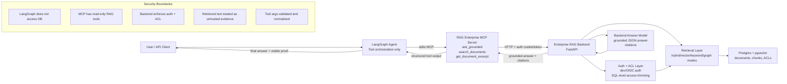

# Portfolio Demo Proof Pack

This guide packages the LangGraph + MCP integration into screenshots and proof
artifacts suitable for an Upwork portfolio. It covers only this LangGraph app.
The RAG backend remains the owner of retrieval, ACL trimming, citations, audit,
cache, and governance.

## What The Demo Proves

- LangGraph orchestrates enterprise RAG questions without direct database access.
- MCP tool discovery exposes `ask_grounded`, `search_documents`, and `get_document_excerpt`.
- The agent calls the MCP server over stdio.
- The MCP server calls the existing enterprise RAG backend over HTTP.
- Backend responses return grounded answers, citations, mode, latency, and chunk counts when available.
- Tool arguments and diagnostics are normalized and redacted for safe proof sharing.

## Commands

Check config and MCP tool discovery:

```bash
rag-enterprise-agent --check-config
```

Run the default demo proof questions:

```bash
rag-enterprise-agent --demo-proof
```

Run one editable question:

```bash
rag-enterprise-agent --demo-proof --question "What does the employee handbook say about VPN access?"
```

Run questions from a file:

```bash
rag-enterprise-agent --demo-proof --questions-file demo-questions.txt
```

Create the Markdown report:

```bash
rag-enterprise-agent --demo-proof --output demo-proof.md
```

Return proof JSON:

```bash
rag-enterprise-agent --demo-proof --json
```

Start the API and capture the proof endpoint:

```bash
rag-enterprise-api
curl http://127.0.0.1:8080/demo-proof
```

Use repeated `question` query parameters for custom API questions:

```bash
curl "http://127.0.0.1:8080/demo-proof?question=What%20does%20the%20policy%20say%3F"
```

## Editable Questions File

Create a plain text file such as `demo-questions.txt`:

```text
What does the employee handbook say about VPN access?
Summarize the policy with citations.
Find the most relevant source excerpt for VPN access.
```

Blank lines and lines starting with `#` are ignored. Update the questions after
you know which documents are indexed in the backend.

## Screenshot Checklist

1. Terminal showing `rag-enterprise-agent --check-config` with MCP tool names.
2. Terminal showing `rag-enterprise-agent --demo-proof` with answer status, tools, citations, and latency.
3. `demo-proof.md` showing runtime summary, MCP inventory, and a detailed answer.
4. Code screenshot of `src/rag_enterprise_langgraph/mcp_client.py` showing stdio MCP setup.
5. Code screenshot of `src/rag_enterprise_langgraph/graph.py` showing the LangGraph prompt rules.
6. API proof screenshot of `curl http://127.0.0.1:8080/demo-proof`.

## Upwork Caption Ideas

- "Built a LangGraph agent that accesses enterprise knowledge only through MCP tools, keeping retrieval and ACL enforcement inside the governed backend."
- "Implemented a screenshot-ready proof pack showing MCP discovery, grounded answers, citations, tool usage, and backend-governance boundaries."
- "Designed the integration so the agent has no direct database access; MCP exposes only read-only RAG tools."

## Architecture



## Honest Boundary

The demo proof feature is not a second RAG implementation. It is a proof layer
for the existing integration. Document ingestion, retrieval, ACL/security
trimming, citations, audit trails, semantic cache policy, approval workflows,
and governance remain implemented in the enterprise RAG backend.
