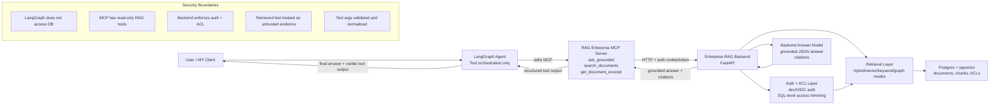

# Upwork Proof Artifacts

Use these proof points after the backend and Ollama are running locally.

## Screenshot checklist

1. Test proof: terminal showing `.venv312/bin/pytest` with all tests passing.
2. MCP discovery proof: CLI output showing `tools/list` with `ask_grounded`, `search_documents`, and `get_document_excerpt`.
3. Successful CLI proof: final answer plus visible `tool_outputs`.
4. Backend proof: `RAG_ENTERPRISE_STARTER` backend terminal showing `POST /ask HTTP/1.1 200 OK`.
5. API proof: `curl http://127.0.0.1:8080/ask` returning JSON.
6. Code proof: `mcp_client.py` showing `MultiServerMCPClient` stdio config.
7. Code proof: `graph.py` showing the LangGraph agent and system prompt.
8. Security proof: the architecture diagram below rendered as PNG/SVG.

Do not include secrets, bearer tokens, raw `.env` content, or private document text.

## Architecture and security diagram

