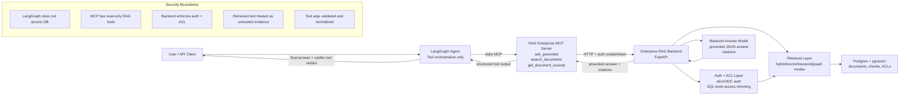

# Upwork Proof Artifacts

Use these proof points after the backend and Ollama are running locally.

Portfolio tile description this repo supports:

> LangGraph/MCP: Reasoning workflow with human approval and a full audit log —
> automation you can inspect.

## Start the API + dashboard

```bash
PYTHONPATH=src .venv312/bin/python -m rag_enterprise_langgraph.server
```

Open <http://127.0.0.1:8080/app>.

## Screenshot checklist (exact names)

1. `Automated Test Suite: 113 Passing Governance & RAG Orchestration Tests`
   ```bash
   .venv312/bin/python -m pytest
   ```
2. `MCP Tool Discovery: Grounded RAG Tools Exposed via Stdio`
   ```bash
   PYTHONPATH=src .venv312/bin/python -m rag_enterprise_langgraph.cli --check-config
   ```
3. `LangGraph Recovery Flow: Evidence-Gated Answer Validation`
   ```bash
   PYTHONPATH=src .venv312/bin/python -m rag_enterprise_langgraph.cli --demo-proof --show-decision-trail
   ```
4. `Enterprise Security Boundary: No Direct DB Access from Agent Layer`
   — render the architecture diagram below as PNG/SVG.
5. `Orchestrator Implementation: Bounded Recovery and Evidence Validation`
   — `src/rag_enterprise_langgraph/orchestrator.py` in an editor.
6. `Human Approval Gate: High-Risk RAG Automation Awaiting Review`
   ```bash
   PYTHONPATH=src .venv312/bin/python -m rag_enterprise_langgraph.cli \
     "What is the employee termination policy?" --require-approval
   ```
   Then capture `/app/approvals` with the pending item, and approve with:
   ```bash
   PYTHONPATH=src .venv312/bin/python -m rag_enterprise_langgraph.cli \
     --approve APPROVAL_ID --reviewer "Alice" --comment "Verified against source"
   ```
7. `Full Audit Log: Inspectable LangGraph/MCP Run Timeline`
   — capture `/app/audit`, or:
   ```bash
   PYTHONPATH=src .venv312/bin/python -m rag_enterprise_langgraph.cli --export-audit RUN_ID
   ```
8. `Eval Dashboard: Accuracy, Faithfulness, Latency, and Estimated Cost`
   ```bash
   PYTHONPATH=src .venv312/bin/python -m rag_enterprise_langgraph.cli \
     --eval-xlsx path/to/your-eval-questions.xlsx --save-eval-run
   ```
   Then capture `/app/evals`. Cost/query is a labeled estimate, not billing.
9. `Red-Team Findings: Failure Modes Tested Before Deployment`
   ```bash
   PYTHONPATH=src .venv312/bin/python -m rag_enterprise_langgraph.cli --red-team \
     --red-team-output red-team-report.md --red-team-json red-team-results.json
   ```
   Then capture `/app/red-team` or the Markdown table.
10. `Before/After Automation: From Weak RAG Answer to Governed Workflow`
    — capture `/app/demo` after running a question through it.

## 90-second before/after screen recording

Record `/app/demo`: type a question, run it, and let the recording show the
raw first-pass column next to the governed workflow column (validation,
recovery, approval gate, run_id, audit event count, tool timeline). If the
backend is down the page shows a clean error state — never fake success.

Do not include secrets, bearer tokens, raw `.env` content, or private document text.
All approval/audit/demo outputs are sanitized by default.

## Architecture and security diagram


